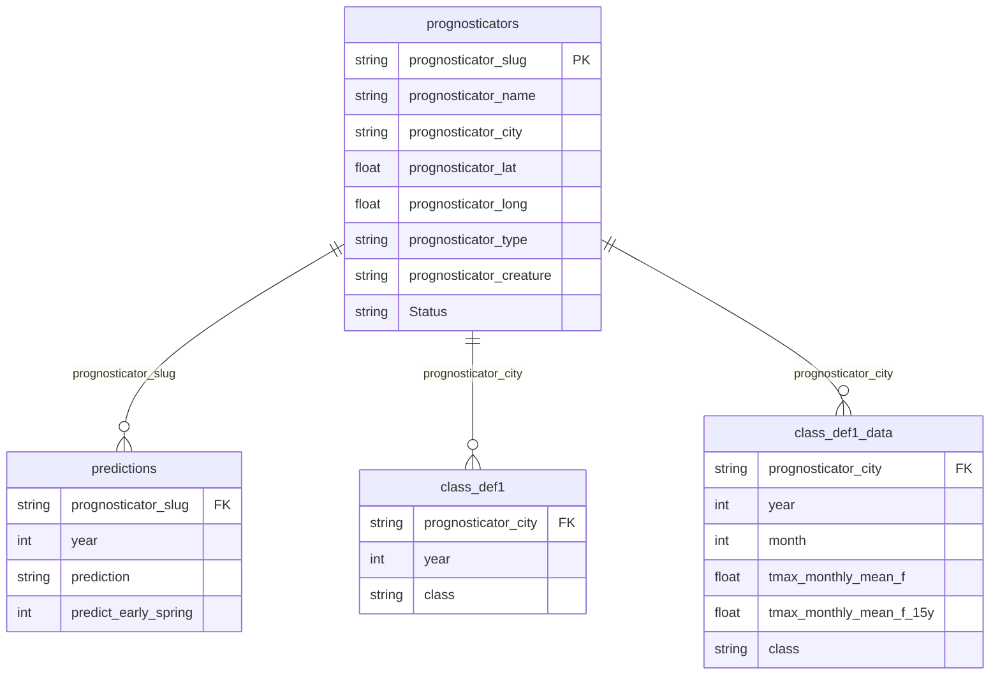

<!-- README.md is generated from README.Rmd -->

```{r, echo = FALSE}
# https://github.com/tidyverse/ggplot2/blob/main/README.Rmd
knitr::opts_chunk$set(
  collapse = TRUE,
  comment = "#>",
  fig.path = "man/figures/README-"
)
```

# feb2 

## Overview

Every year on February 2, [Groundhog Day](https://en.wikipedia.org/wiki/Groundhog_Day), the famous groundhog [Punxsutawney Phil](https://en.wikipedia.org/wiki/Punxsutawney_Phil)—and a growing cast of creatures (including stuffed animals, sock puppets, and mascots)—emerge from their burrows to predict the weather. Punxsutawney Phil, the prognosticator of prognosticators, has been predicting the weather since 1887. If he sees his shadow, his prediction is for six more weeks of winter. If not, he predicts an early spring.

This package brings together prediction data from [Countdown to Groundhog Day](https://countdowntogroundhogday.com/) and weather data from [Open-Meteo](https://open-meteo.com/) to help you evaluate which prognosticators you can trust.

## Installation

```{r, eval = FALSE}
# Install from GitHub
devtools::install_github("ericpgreen/feb2")
```

## Usage

Currently this is a function-less data package designed to facilitate your analyses of Groundhog Day prediction data.

```{r library}
library(feb2)
```


## Datasets

There are three main datasets and several supporting datasets.



### `prognosticators`

Michael Venos, the creator of [Countdown to Groundhog Day](https://countdowntogroundhogday.com/), maintains the internet's most comprehensive database about Groundhog Day predictions. He generously agreed to allow me to incorporate his data into this package. Currently he has data on a diverse collection of `r nrow(prognosticators)` prognosticators.

Each prognosticator is uniquely identified by a `prognosticator_slug` derived from their URL on the Countdown to Groundhog Day website. This allows for accurate linking even when multiple prognosticators share the same name (e.g., there are multiple "Woody" prognosticators in different cities).

```{r prognosticators, message=FALSE}
library(tidyverse)
prognosticators %>%
  group_by(prognosticator_status) %>%
  count()
```

Rodents are by far the most common prognosticators. One lobster is holding it down for the arthropods.

```{r prognosticators-type}
prognosticators %>%
  group_by(prognosticator_phylum, prognosticator_class, prognosticator_order) %>%
  count()
```

### `predictions`

Michael has collected `r nrow(predictions)` predictions going back to Punxsutawney Phil's first prediction in 1887. Some years the prediction is uncertain or not recorded, accounting for the `NA`s.

Predictions are linked to prognosticators via `prognosticator_slug`, ensuring accurate attribution even for prognosticators with duplicate names.

```{r predictions}
predictions %>%
  group_by(prediction) %>%
  count()
```

### `class_def1`

The biggest challenge for evaluating Groundhog Day predictions is defining what we mean by "early spring". So far in this package I follow the general approach of earlier analyses by [NOAA](https://www.ncei.noaa.gov/news/groundhog-day-forecasts-and-climate-history) and [538](https://fivethirtyeight.com/features/groundhogs-do-not-make-good-meteorologists/). I define early spring for a prognosticator's location as one month (February OR March) with an average high temperature above the historical average for that month.[^15days] Unlike the previous analyses, however, I use local data for each prognosticator. NOAA used U.S. national temperatures, and 538 looked across nine U.S. regions.[^years] I think it's just silly to expect a real or stuffed groundhog to be able to predict national or regional weather based on localized sunshine. I say let's evaluate their powers of prognostication using local data.[^def1]

[^15days]: 538 uses the 15-year rolling mean, and so do I.

[^years]: NOAA evaluated Phil's predictions from 2012-2021. 538 expanded the scope of the inquiry from 1 to 9 prognosticators, and included more years, 1994-2021.

[^def1]: I refer to this classification definition as `def1`.

#### Current Coverage

The `class_def1` dataset currently covers:

- **158 unique cities** (prognosticator locations with valid coordinates)
- **Years 1887-2025** (pre-1940 data from GHCND for Punxsutawney, 1940+ from Open-Meteo)
- **~14,000 city-year classifications**

```{r class_def1_summary}
class_def1 %>%
  filter(!is.na(class)) %>%
  count(class)
```

## Weather Data

Weather data comes from [Open-Meteo's Historical Weather API](https://open-meteo.com/en/docs/historical-weather-api), which provides ERA5 reanalysis data back to 1940. Each prognosticator's city is geocoded to coordinates, and daily maximum temperatures are retrieved directly for those coordinates.

For Punxsutawney Phil's predictions from 1887-1939 (before Open-Meteo coverage), weather data comes from nearby NOAA GHCND weather stations.

The `weather_stations_ghcnd` and `weather_stations_isd` datasets contain historical weather station information and may be useful for supplementary analyses.

### Reproducing the Weather Data

The raw weather data files (~5 million daily temperature records) are **not committed to this repository** due to their size. The processed classification data (`class_def1.rda` and `class_def1_data.rda`) is included.

To reproduce the weather data collection from scratch:

1. Run `data-raw/weather_openmeteo_batch.R` to collect daily temperatures from Open-Meteo (note: may take time due to API rate limits)
2. Run `data-raw/process_openmeteo_batch.R` to process raw data into classifications
3. Run `data-raw/export_json.R` to export JSON files for web applications

#### Classification Steps

1. Geocode each prognosticator's city to latitude/longitude coordinates
2. Query Open-Meteo Historical API for daily maximum temperatures (February and March, 1940-present)
3. Calculate the mean monthly high temperature for each location
4. Calculate the 15-year rolling mean high monthly temperature
5. Use the `def1` definition to classify each year as "early spring" or "long winter"

The `class_def1` dataset contains one row per city-year with the classification. The `class_def1_data` dataset contains the underlying monthly temperature data and rolling averages.

## JSON Exports

For web applications (like [Byte Burrower](https://www.groundhogday.app/)), JSON exports are available in `inst/json/`:

- `prognosticators.json` - All prognosticator data
- `predictions.json` - All predictions
- `class_def1.json` - Classification data
- `accuracy.json` - Accuracy statistics by prognosticator

These are regenerated by running `data-raw/export_json.R`.

## Updates

I plan to update the prognosticators, predictions, and classifications data after the month of March (classification definition `def1` depends on March weather data).

## Data Use

Open-Meteo weather data is available under [CC BY 4.0](https://creativecommons.org/licenses/by/4.0/). Data on prognosticators and their predictions come with permission from [Countdown to Groundhog Day](https://countdowntogroundhogday.com/). You are welcome to use the data via this package for any purpose, but please do not post the raw data on any other public sites. Instead, give credit to Michael's tremendous effort by pointing back to [Countdown to Groundhog Day](https://countdowntogroundhogday.com/).

## See Also

- [Byte Burrower](https://www.groundhogday.app/) - An AI-powered groundhog that uses this data to make personalized predictions for your location
- [Data Science and Byte Burrower](https://groundhogday.site/episode/Data-Science-and-Byte-Burrower) - Podcast episode discussing the data science behind Groundhog Day predictions

## Hex Sticker

The groundhog pixel art is a [DALL-E 2](https://openai.com/dall-e-2/) creation.

## Issues

Please [submit an issue](https://github.com/ericpgreen/feb2/issues) if you encounter any bugs or errors. This package comes with no warranty of any kind. Don't rely on me or these rodents to get it right. Though my family did live in Punxsutawney when I was 4, and I have been to Gobbler's Knob.

```{r me, echo=FALSE, fig.cap="Me visting Gobbler's Knob as a child."}
  knitr::include_graphics(path="man/figures/gk.png")
```
