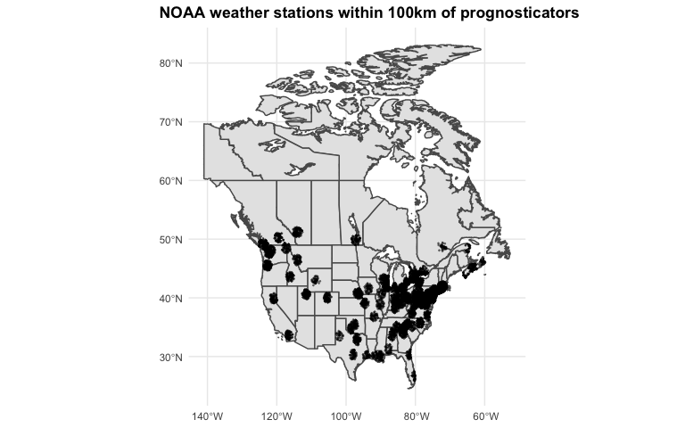

<!-- README.md is generated from README.Rmd -->

# feb2 

## Overview

Every year on February 2, [Groundhog
Day](https://en.wikipedia.org/wiki/Groundhog_Day), the famous groundhog
[Punxsutawney Phil](https://en.wikipedia.org/wiki/Punxsutawney_Phil)—and
a growing cast of creatures (including stuffed animals, sock puppets,
and mascots)—emerge from their burrows to predict the weather.
Punxsutawney Phil, the prognosticator of prognosticators, has been
predicting the weather since 1887. If he sees his shadow, his prediction
is for six more weeks of winter. If not, he predicts an early spring.

This package brings together prediction data from [Countdown to
Groundhog Day](https://countdowntogroundhogday.com/) and weather data
from the [U.S. National Ocean and Atmospheric Administration
(NOAA)](https://www.noaa.gov/) to help you evaluate which
prognosticators you can trust.

## Installation

``` r
# Install from GitHub
devtools::install_github("ericpgreen/feb2")
```

## Usage

Currently this is a function-less data package designed to facilitate
your analyses of Groundhog Day prediction data.

``` r
library(feb2)
```

## Datasets

There are three main datasets and several supporting datasets.


### `prognosticators`

Michael Venos, the creator of [Countdown to Groundhog
Day](https://countdowntogroundhogday.com/), maintains the internet’s
most comprehensive database about Groundhog Day predictions. He
generously agreed to allow me to incorporate his data into this package.
Currently he has data on a diverse collection of 153 prognosticators.

``` r
library(tidyverse)
prognosticators %>%
  group_by(prognosticator_status) %>%
  count()
#> # A tibble: 3 × 2
#> # Groups:   prognosticator_status [3]
#>   prognosticator_status     n
#>   <chr>                 <int>
#> 1 Creature                110
#> 2 Human Mascot             11
#> 3 Inanimate                32
```

Rodents are by far the most common prognosticators. One lobster is
holding it down for the arthropods.

``` r
prognosticators %>%
  group_by(prognosticator_phylum, prognosticator_class, prognosticator_order) %>%
  count()
#> # A tibble: 15 × 4
#> # Groups:   prognosticator_phylum, prognosticator_class, prognosticator_order
#> #   [15]
#>    prognosticator_phylum prognosticator_class prognosticator_order     n
#>    <chr>                 <chr>                <chr>                <int>
#>  1 Arthropoda            Malacostraca         Decapoda                 1
#>  2 Chordata              Actinopterygii       Perciformes              1
#>  3 Chordata              Amphibia             Anura                    1
#>  4 Chordata              Aves                 Anseriformes             2
#>  5 Chordata              Aves                 Galliformes              1
#>  6 Chordata              Aves                 Strigiformes             1
#>  7 Chordata              Mammalia             Artiodactyla             1
#>  8 Chordata              Mammalia             Carnivora                9
#>  9 Chordata              Mammalia             Cingulata                1
#> 10 Chordata              Mammalia             Didelphimorphia          3
#> 11 Chordata              Mammalia             Eulipotyphla             7
#> 12 Chordata              Mammalia             Rodentia               121
#> 13 Chordata              Mammalia             Tubulidentata            1
#> 14 Chordata              Reptilia             Crocodilia               2
#> 15 Chordata              Reptilia             Testudines               1
```

### `predictions`

Michael has collected 1488 predictions going back to Punxsutawney Phil’s
first prediction in 1887. Some years the prediction is uncertain or not
recorded, accounting for the `NA`s.

``` r
predictions %>%
  group_by(prediction) %>%
  count()
#> # A tibble: 3 × 2
#> # Groups:   prediction [3]
#>   prediction       n
#>   <chr>        <int>
#> 1 Early Spring   726
#> 2 Long Winter    733
#> 3 <NA>            29
```

### `weather_stations_ghcnd`

Each prognosticator is linked to a city. I used the {`tidygeocoder`}
package to get coordinates for each city and then searched for weather
stations with TMAX (daily max air temperature) data within 100km of each
city’s coordinates using the `meteo_nearby_stations()` function in the
{`rnoaa`} package. This dataset lists every eligible weather station
within 100km, but the package only uses weather data from (up to) the 10
closest stations.

<!-- -->

### `class_def1`

The biggest challenge for evaluating Groundhog Day predictions is
defining what we mean by “early spring”. So far in this package I follow
the general approach of earlier analyses by
[NOAA](https://www.ncei.noaa.gov/news/groundhog-day-forecasts-and-climate-history)
and
[538](https://fivethirtyeight.com/features/groundhogs-do-not-make-good-meteorologists/)—with
one difference. I define early spring for a prognosticator’s location as
one month (February OR March) with an average high temperature above the
historical average for that month.[^1] Unlike the previous analyses,
however, I use local data for each prognosticator. NOAA used U.S.
national temperatures, and 538 looked across nine U.S. regions. I think
it’s just silly to expect a real or stuffed groundhog to be able to
predict national or regional weather based on localized sunshine. I say
let’s evaluate their powers of prognostication using local data.[^2]

The `class_def1` dataset does not contain the underlying weather data,
but you can find it in `class_def1_data`. You can also use the {`rnoaa`}
package and the weather station information in `weather_stations_ghcnd`
and `weather_stations_isd` to query the weather data directly if you are
interested in creating a new classification definition.

## Updates

I plan to update the prognosticators, predictions, and classifications
data after the month of March (classification definition `def1` depends
on March weather data).

## Data Use

NOAA weather data are in the public domain (as far as I know). Data on
prognosticators and their predictions come with permission from
[Countdown to Groundhog Day](https://countdowntogroundhogday.com/). You
are welcome to use the data via this package for any purpose, but please
do not post the raw data on any other public sites. Instead, give credit
to Michael’s tremendous effort by pointing back to [Countdown to
Groundhog Day](https://countdowntogroundhogday.com/).

This package comes with no warranty of any kind. Don’t rely on me or
these rodents to get it right.

## Issues

Please [submit an issue](https://github.com/ericpgreen/feb2/issues) if
you encounter any bugs or errors.

## Hex Sticker

The groundhog pixel art is a [DALL-E 2](https://openai.com/dall-e-2/)
creation.

[^1]: 538 uses the 15-year rolling mean, and so do I.

[^2]: I refer to this classification definition as `def1`.
